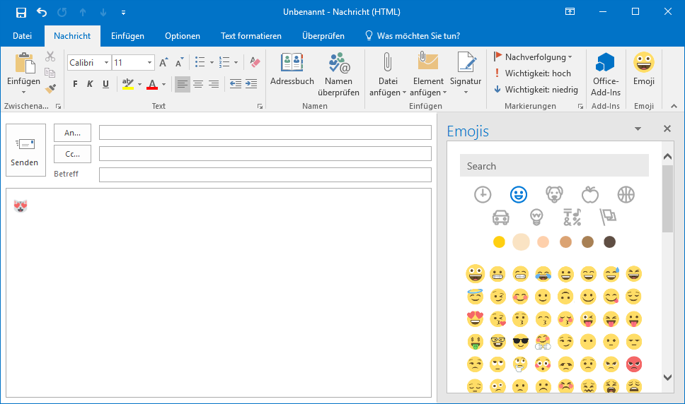
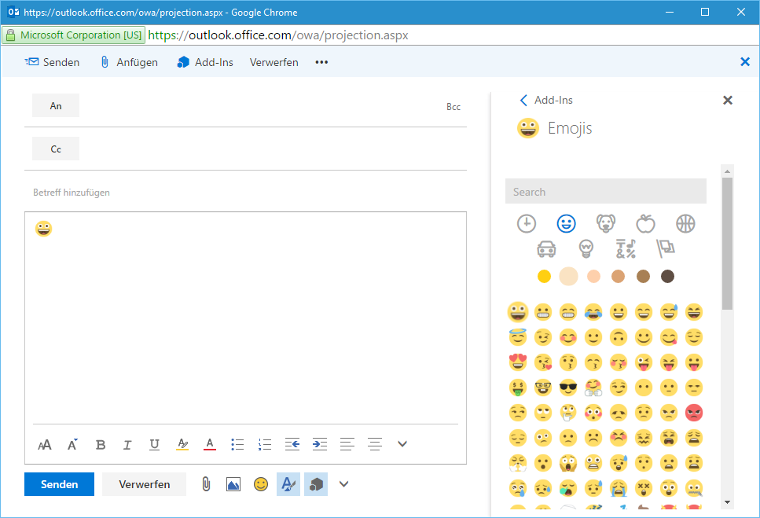

# Emoji for Outlook

Adds an emoji task pane to Outlook (desktop and web) using the awesome [EmojiOne](https://emojione.com) emoji set. Features:

* History
* Categories
* Select preferred skin tone
* Search based on names and keywords
* Works for HTML and text only emails

## Outlook Desktop

## Outlook Web

