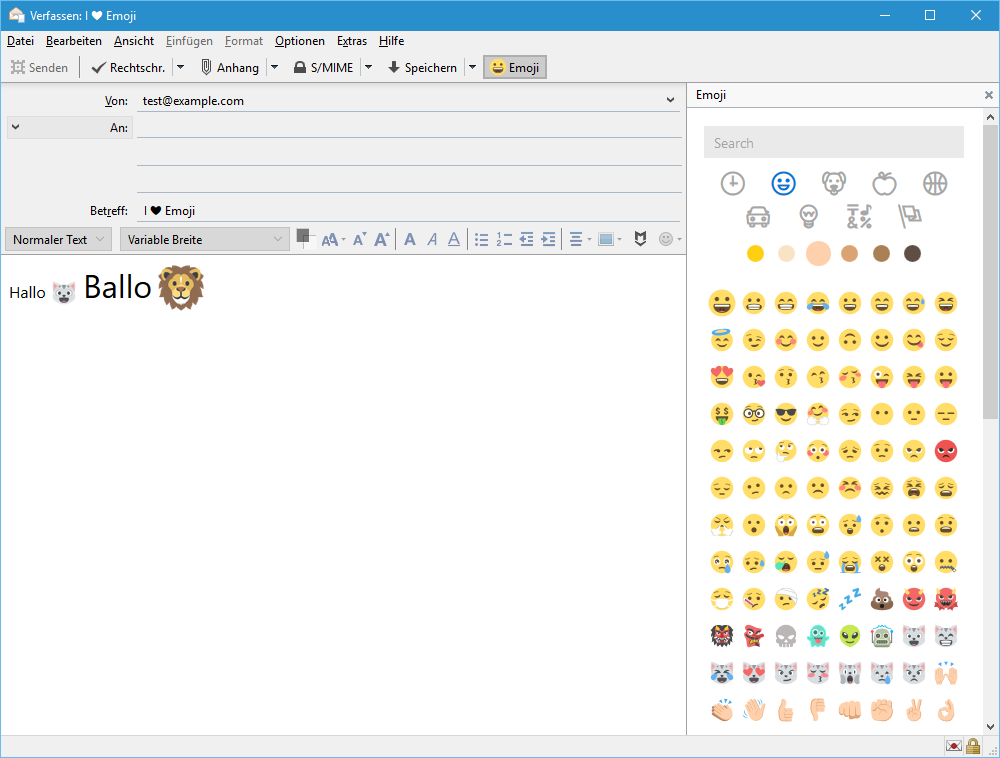

# Emoji for Outlook and Thunderbird

Adds an emoji task pane to Outlook (desktop and web) and Mozilla Thunderbird using the awesome [JoyPixels](https://www.joypixels.com/) (fka EmojiOne) emoji set. Features:

* History
* Categories
* Select preferred skin tone
* Search based on names and keywords
* Works for HTML and text only emails
* Chat (Thunderbird only)

## Installation

### Outlook

Go to [the add-in's page in the Office Store](https://store.office.com/en-us/app.aspx?assetid=WA104380335) and click the Add button. Once you have added the add-in to your online account it will automatically be available from within Outlook Desktop also. If Outlook Desktop is open when you add the add-in online, you need to close and re-open Outlook Desktop for the add-in to become available there.

The add-in works only with Exchange, Office 365, and Outlook.com account types, not IMAP or POP accounts. This is a limitation of Outlook add-ins in general. From the [documentation](https://docs.microsoft.com/en-us/outlook/add-ins/add-in-requirements):

> The client must be connected to an Exchange server or Office 365 using a direct connection. When configuring the client, the user must choose an Exchange, Office 365, or Outlook.com account type. If the client is configured to connect with POP3 or IMAP, add-ins will not load.

If you have both types of accounts configured, you can write an email using the Exchange-based account, then switch to the IMAP/POP account before sending by using the "From:" dropdown.

### Thunderbird

In Thunderbird, go to Tools → Add-ons → Extensions and search for "Emoji" in the search box in the upper right-hand corner. In the result list, click Install on the right side.

You can also download the add-on from its [detail page at Mozilla](https://addons.mozilla.org/de/thunderbird/addon/emojiaddin/) and then install using the [instructions here](http://kb.mozillazine.org/Extensions_(Thunderbird)).

Once you have installed the add-on and restarted Thunderbird, the add-on will be available from the View menu when you write a message. The toolbar button won't be visible by default, but you can add it to the toolbar by [customizing the toolbar](https://support.mozilla.org/en-US/kb/how-customize-toolbars).

## Screenshots

### Outlook Desktop

### Outlook Web

### Thunderbird

